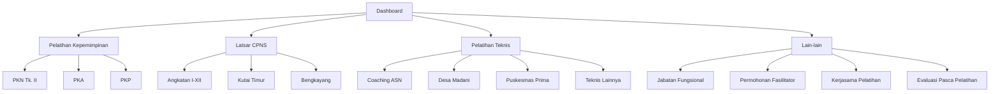
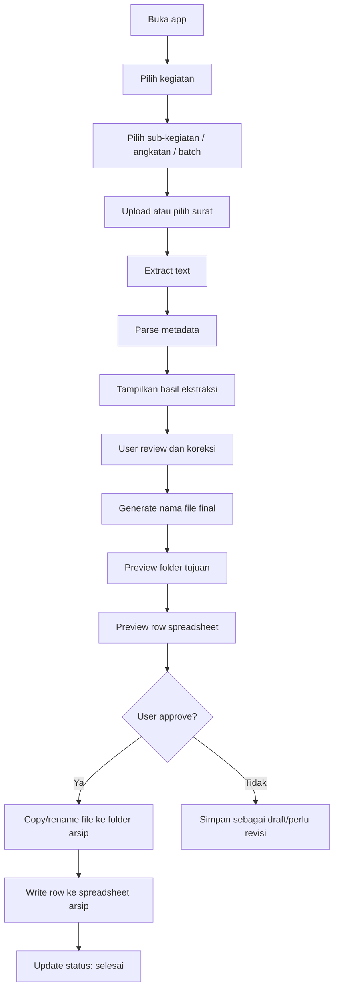

# Menu and User Flow

## Kenapa Menu Dibagi 4 Kegiatan

Menu 4 kegiatan bukan hanya untuk browsing folder.

Menu ini menjadi konteks kerja untuk menentukan:

- Spreadsheet/laci yang dipakai.
- Folder tujuan final.
- Daftar sub-kegiatan.
- Schema metadata.
- Aturan penomoran item arsip.
- Template nama file.
- Status pekerjaan per kegiatan.

Dengan user memilih kegiatan di awal, app tidak perlu menebak semuanya dari nol.

## Information Architecture

## Main Workflow

## Screen List

### 1. Dashboard

Komponen:

- Kartu 4 kegiatan.
- Count status: draft, perlu review, selesai.
- Tombol proses dokumen baru.

### 2. Activity Detail

Komponen:

- List sub-kegiatan/angkatan/batch.
- Status per sub-kegiatan.
- Shortcut ke folder Drive output.
- Shortcut ke spreadsheet arsip.

### 3. Document Intake

Komponen:

- Upload PDF/DOCX.
- Pilih dari Google Drive.
- Pilih tingkat perkembangan default.
- Tombol proses.

### 4. Metadata Review

Komponen:

- Preview teks hasil ekstraksi.
- Form metadata dinamis sesuai schema kegiatan.
- Confidence indicator per field.
- Tombol generate nama file.

### 5. Final Preview

Komponen:

- Nama file final.
- Folder tujuan.
- Spreadsheet tujuan.
- Preview row yang akan ditulis.
- Tombol approve final.

### 6. History/Log

Komponen:

- Daftar dokumen yang sudah diproses.
- Status.
- Link file final.
- Link row spreadsheet.
- Error log jika ada.

### 7. Settings

Komponen:

- Mapping kegiatan ke folder.
- Mapping kegiatan ke spreadsheet.
- Schema metadata per kegiatan.
- Template nama file.

