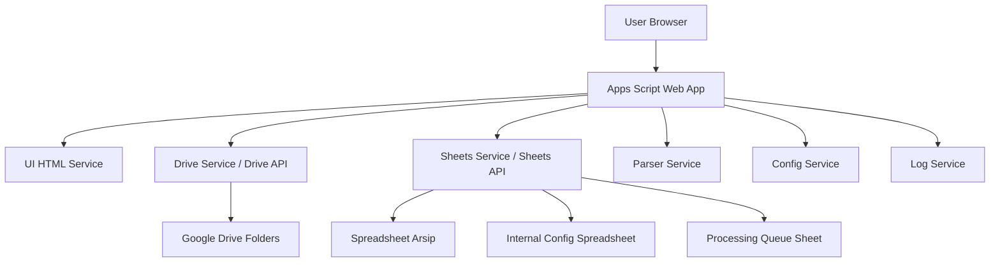

# Google Apps Script Architecture

## Stack

- Google Apps Script Web App
- HTML Service untuk UI
- Google Drive API
- Google Sheets API
- Google Drive sebagai file storage
- Google Sheets sebagai config, queue, log, dan output arsip

## High Level Architecture



## Suggested Apps Script Modules

```text
/Code.gs
/ui/Dashboard.html
/ui/ActivityDetail.html
/ui/DocumentReview.html
/services/ConfigService.gs
/services/DriveService.gs
/services/SheetService.gs
/services/ParserService.gs
/services/NamingService.gs
/services/QueueService.gs
/services/LogService.gs
/services/ValidationService.gs
```

In Apps Script, folder/module fisik bisa disesuaikan dengan tooling. Jika memakai Apps Script editor langsung, penamaan file `.gs` dan `.html` cukup mewakili pembagian modul.

## Core Services

### ConfigService

Tugas:

- Membaca konfigurasi kegiatan.
- Membaca sub-kegiatan.
- Membaca schema metadata.
- Membaca template nama file.
- Menentukan folder dan spreadsheet tujuan.

### DriveService

Tugas:

- List folder kegiatan.
- Ambil file sumber.
- Copy file ke folder final.
- Rename file final.
- Ambil URL file.

### SheetService

Tugas:

- Membaca spreadsheet arsip.
- Menentukan row berikutnya.
- Menulis metadata final.
- Menyimpan link file final jika kolom tersedia.

### ParserService

Tugas:

- Extract text dari Google Docs/DOCX jika memungkinkan.
- Extract text dari PDF digital jika memungkinkan.
- Fallback OCR disiapkan untuk fase berikutnya jika perlu.
- Parse nomor surat, tanggal, perihal, pengirim, tujuan.

### NamingService

Tugas:

- Generate nama file sesuai template kegiatan.
- Membersihkan karakter ilegal nama file.
- Mencegah duplikasi nama file.

### QueueService

Tugas:

- Menyimpan dokumen yang sedang diproses.
- Status: draft, extracted, review_needed, approved, completed, failed.
- Menyimpan hasil ekstraksi awal dan hasil review final.

### LogService

Tugas:

- Mencatat semua aksi penting.
- Mencatat error.
- Membantu audit jika ada file salah proses.

## Write Safety

MVP wajib punya prinsip aman:

- Tidak rename file sumber.
- Tidak menghapus file.
- Tidak memindahkan file sumber.
- Output dibuat dengan copy ke folder arsip.
- Write ke spreadsheet hanya setelah user approve.
- Semua aksi final dicatat di log.

## Recommended Internal Google Sheets

Buat satu spreadsheet internal khusus app, misalnya:

```text
Portal Arsip - App Config
```

Tab yang disarankan:

- `config_activity`
- `config_sub_activity`
- `config_schema_fields`
- `config_naming_templates`
- `archive_queue`
- `process_log`

