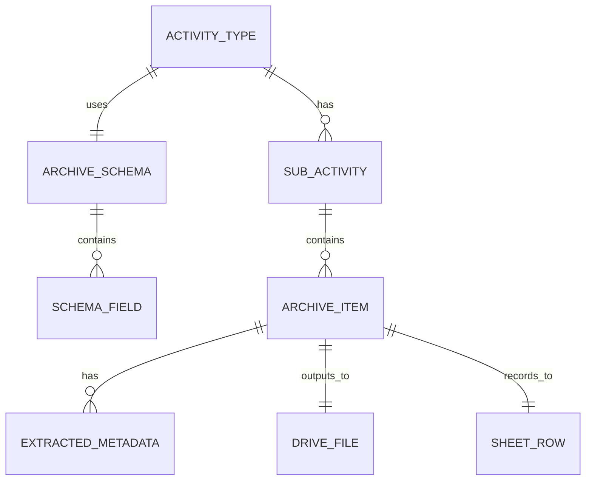
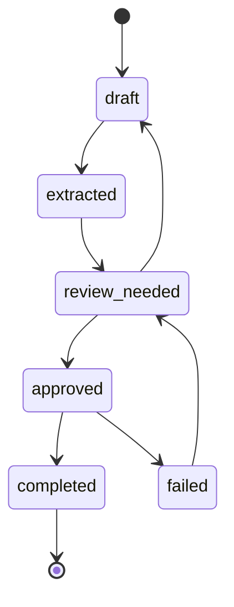

# Data Model and Metadata Schema

## Prinsip Utama

Metadata arsip tidak boleh dibuat satu form kaku untuk semua kegiatan.

Setiap kegiatan/laci dapat memiliki kebutuhan metadata dan target spreadsheet yang berbeda. Karena itu app perlu schema metadata dinamis.

## Core Relationship



## Common Core Fields

Field ini berlaku untuk semua dokumen:

| Field | Fungsi |
| --- | --- |
| `archive_item_id` | ID internal proses |
| `activity_id` | Kepemimpinan, Latsar, Teknis, Lain-lain |
| `sub_activity_id` | Angkatan/batch/sub-folder |
| `source_file_id` | File sumber dari upload/Drive |
| `source_file_name` | Nama file sumber |
| `source_text` | Teks hasil ekstraksi |
| `target_folder_id` | Folder final di Drive |
| `target_spreadsheet_id` | Spreadsheet daftar arsip |
| `target_sheet_name` | Sheet/tab tujuan |
| `final_file_name` | Nama file final |
| `final_file_id` | File final setelah copy/rename |
| `status` | Status proses |
| `created_at` | Waktu dibuat |
| `updated_at` | Waktu update |

## Dynamic Metadata Fields

Field ini mengikuti schema kegiatan/laci:

| Field Umum Arsip | Sumber |
| --- | --- |
| `no_berkas` | User/config/spreadsheet |
| `nomor_item_arsip` | Auto increment per sub-kegiatan/sheet |
| `kode_klasifikasi` | User/config/parser |
| `uraian_informasi` | Parser + user review |
| `tanggal_arsip` | Parser + user review |
| `tingkat_perkembangan` | User select/parser |
| `jumlah` | User input/default |
| `satuan` | User input/default, misal lembar |
| `no_filing_cabinet` | Config |
| `no_laci` | Config |
| `no_folder` | Config/sub-kegiatan |
| `klasifikasi_akses` | User/config |
| `keterangan` | Optional |
| `lokasi_simpan` | Nama file final atau link |

## Config Sheet: config_activity

Contoh kolom:

```text
activity_id
activity_name
laci_no
archive_spreadsheet_id
archive_folder_id
source_folder_id
schema_id
active
```

Contoh isi:

```text
kepemimpinan | Pelatihan Kepemimpinan | 1 | ... | ... | ... | schema_kepemimpinan | TRUE
latsar | Latsar CPNS | 2 | ... | ... | ... | schema_latsar | TRUE
teknis | Pelatihan Teknis | 3 | ... | ... | ... | schema_teknis | TRUE
lain_lain | Lain-lain | 4 | ... | ... | ... | schema_lain_lain | TRUE
```

## Config Sheet: config_sub_activity

Contoh kolom:

```text
sub_activity_id
activity_id
sub_activity_name
target_folder_id
target_sheet_name
no_folder
active
```

Contoh isi:

```text
latsar_angkatan_i | latsar | Latsar CPNS Angkatan I | ... | Angkatan I | 2 | TRUE
pkn_ii_x | kepemimpinan | PKN Tk. II Angkatan X | ... | PKN Tk.II | 1 | TRUE
coaching_batch_1 | teknis | Coaching ASN Batch 1 | ... | Coaching Batch 1 | 1 | TRUE
```

## Config Sheet: config_schema_fields

Contoh kolom:

```text
schema_id
field_key
field_label
field_type
required
source_hint
output_column
default_value
display_order
```

Contoh isi:

```text
schema_latsar | nomor_item_arsip | Nomor Item Arsip | number | TRUE | auto_increment | Nomor Item Arsip | | 10
schema_latsar | kode_klasifikasi | Kode Klasifikasi | text | FALSE | user_or_parser | Kode Klasifikasi | PDP.07.1 | 20
schema_latsar | uraian_informasi | Uraian Informasi Arsip | textarea | TRUE | parser | Uraian informasi Berkas | | 30
schema_latsar | tanggal_arsip | Tanggal | date | TRUE | parser | Tgl | | 40
schema_latsar | tingkat_perkembangan | Tingkat Perkembangan | select | TRUE | user_select | Tingkat Pengembangan | Srikandi | 50
```

## Config Sheet: config_naming_templates

Contoh kolom:

```text
schema_id
template_name
template_pattern
active
```

Contoh pattern:

```text
{nomor_item_arsip}. ({tingkat_perkembangan}) No: {nomor_surat}_{ringkasan_perihal}.pdf
```

## Sheet: archive_queue

Berfungsi sebagai database proses.

Contoh kolom:

```text
archive_item_id
activity_id
sub_activity_id
source_file_id
source_file_name
extracted_text_hash
extracted_metadata_json
reviewed_metadata_json
final_file_name
final_file_id
target_folder_id
target_spreadsheet_id
target_sheet_name
status
error_message
created_at
updated_at
```

## Sheet: process_log

Contoh kolom:

```text
timestamp
archive_item_id
actor
action
status
message
payload_json
```

## Status Lifecycle



