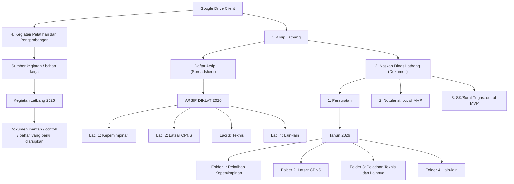
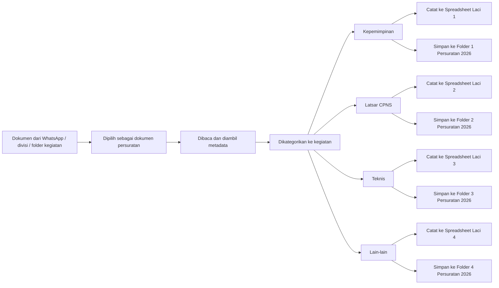
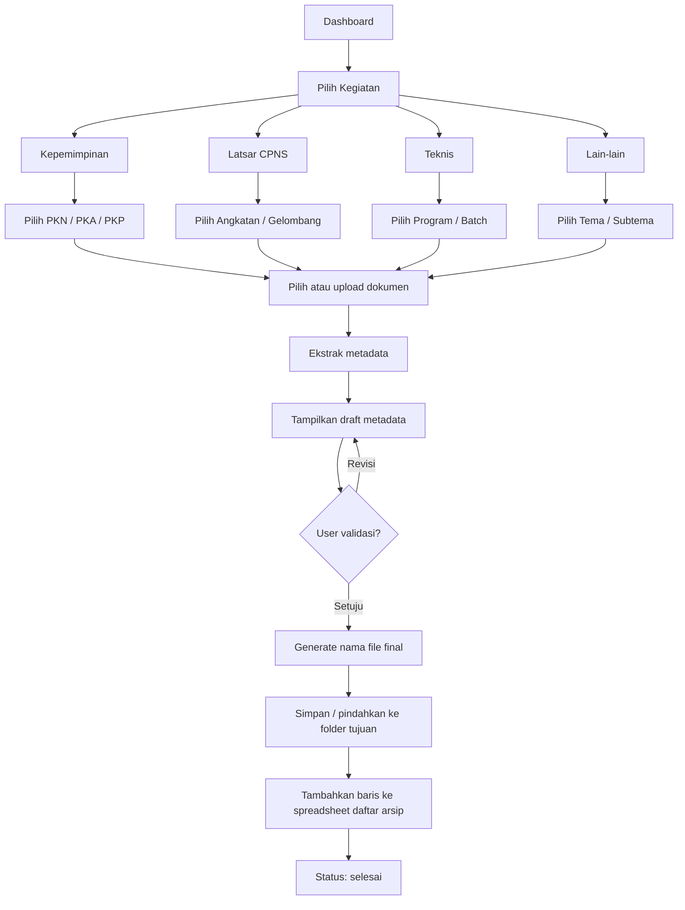
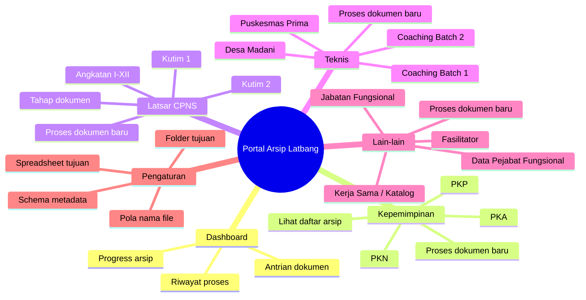
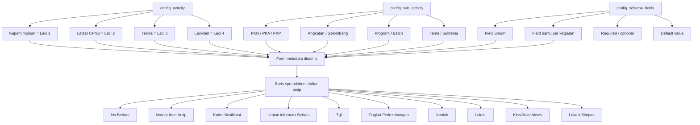
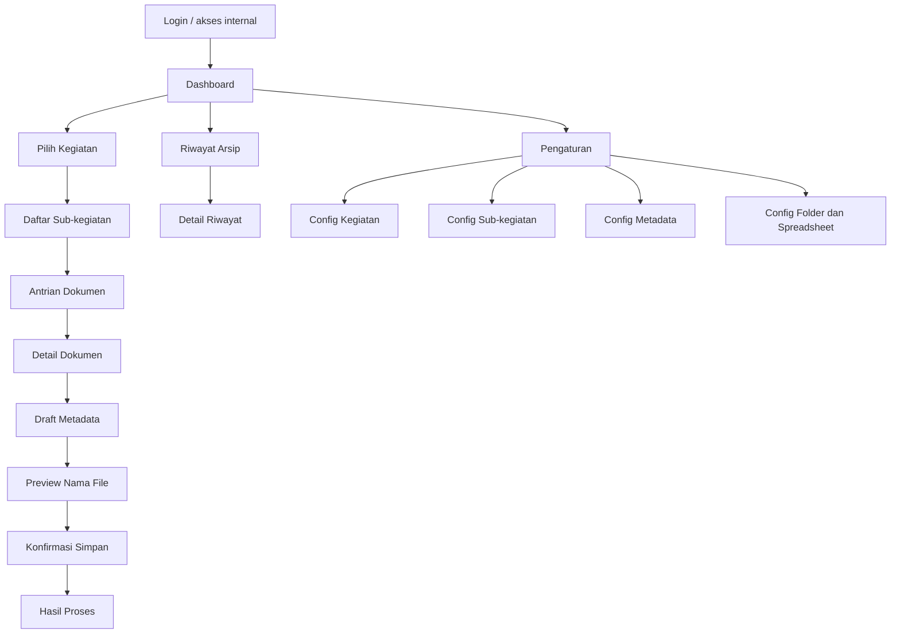
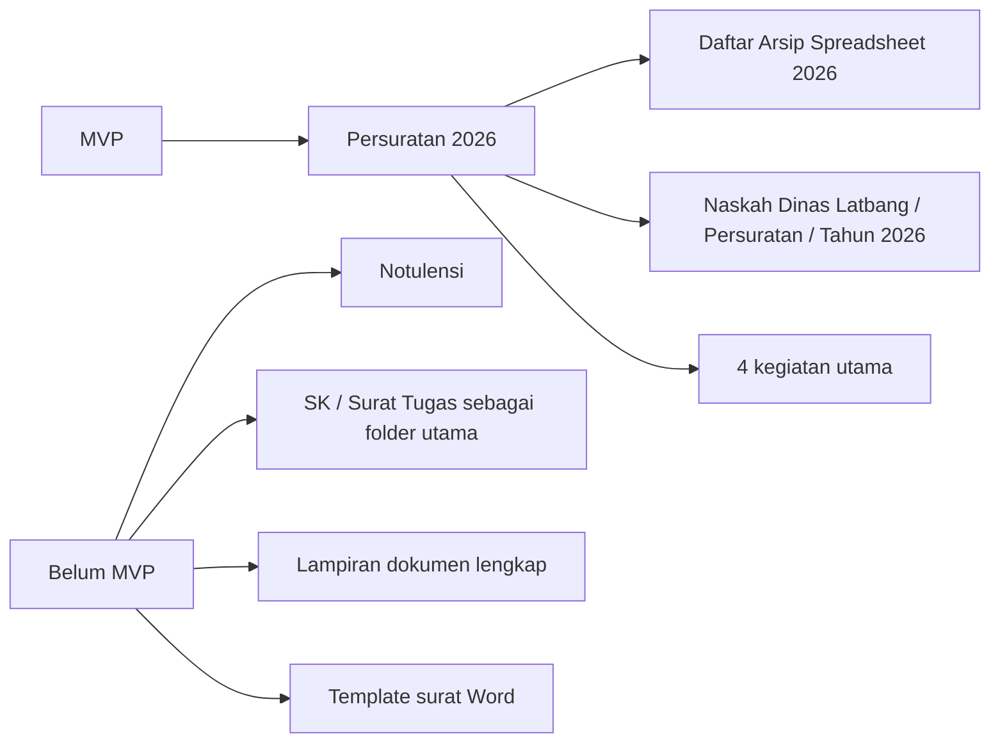

# Visual Map Pre-Development Portal Arsip

Dokumen ini merangkum rancangan pre-development dalam bentuk visual agar mudah dipakai untuk diskusi dan validasi ke client.

## 1. Peta Scope Sistem

## 2. Hubungan Folder dan Output Kerja

## 3. Flow Kerja User di Aplikasi

## 4. Struktur Menu MVP

## 5. Relasi Config Metadata ke Spreadsheet

## 6. Screen Map MVP

## 7. Batas MVP Yang Perlu Ditegaskan ke Client

