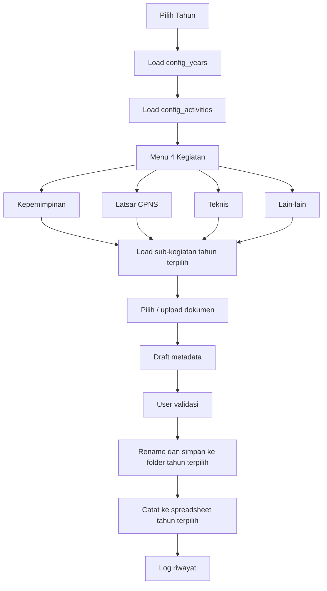

# Multi-Year Folder Architecture - Portal Arsip Latbang

Dokumen ini merancang struktur folder dan konfigurasi aplikasi agar Portal Arsip Latbang tidak hanya bekerja untuk 2026, tetapi juga bisa dipakai untuk 2027, 2028, dan tahun-tahun berikutnya.

## Prinsip Utama

1. Tahun menjadi konteks kerja utama.
2. Kegiatan tetap menjadi menu utama.
3. Sub-kegiatan bisa bertambah dari aplikasi.
4. Folder Drive dan spreadsheet tujuan tidak di-hardcode di source code.
5. Setiap tahun punya konfigurasi folder, spreadsheet, dan sub-kegiatan sendiri.

## Struktur Drive Yang Direkomendasikan

Struktur existing di Drive saat ini:

```text
1. Arsip Latbang
├─ 1. Daftar Arsip (Spreadsheet)
│  └─ ARSIP DIKLAT 2026
│     ├─ LACI NO 1 (KEPEMIMPINAN)
│     ├─ LACI NO 2 (LATSAR CPNS)
│     ├─ LACI NO 3 (TEKNIS)
│     └─ LACI NO 4 (LAIN-LAIN)
└─ 2. Naskah Dinas Latbang (Dokumen)
   └─ 1. Persuratan
      └─ Tahun 2026
         ├─ Folder 1 (Pelatihan Kepemimpinan)
         ├─ Folder 2 (Latsar CPNS)
         ├─ Folder 3 (Pelatihan Teknis dan Lainnya)
         └─ Folder 4 (Lain-lain)
```

Struktur multi-year yang direkomendasikan:

```text
1. Arsip Latbang
├─ 1. Daftar Arsip (Spreadsheet)
│  ├─ ARSIP DIKLAT 2026
│  │  ├─ LACI NO 1 (KEPEMIMPINAN)
│  │  ├─ LACI NO 2 (LATSAR CPNS)
│  │  ├─ LACI NO 3 (TEKNIS)
│  │  └─ LACI NO 4 (LAIN-LAIN)
│  ├─ ARSIP DIKLAT 2027
│  │  ├─ LACI NO 1 (KEPEMIMPINAN)
│  │  ├─ LACI NO 2 (LATSAR CPNS)
│  │  ├─ LACI NO 3 (TEKNIS)
│  │  └─ LACI NO 4 (LAIN-LAIN)
│  └─ ARSIP DIKLAT 2028
│     ├─ LACI NO 1 (KEPEMIMPINAN)
│     ├─ LACI NO 2 (LATSAR CPNS)
│     ├─ LACI NO 3 (TEKNIS)
│     └─ LACI NO 4 (LAIN-LAIN)
└─ 2. Naskah Dinas Latbang (Dokumen)
   └─ 1. Persuratan
      ├─ Tahun 2026
      │  ├─ Folder 1 (Pelatihan Kepemimpinan)
      │  ├─ Folder 2 (Latsar CPNS)
      │  ├─ Folder 3 (Pelatihan Teknis dan Lainnya)
      │  └─ Folder 4 (Lain-lain)
      ├─ Tahun 2027
      │  ├─ Folder 1 (Pelatihan Kepemimpinan)
      │  ├─ Folder 2 (Latsar CPNS)
      │  ├─ Folder 3 (Pelatihan Teknis dan Lainnya)
      │  └─ Folder 4 (Lain-lain)
      └─ Tahun 2028
         ├─ Folder 1 (Pelatihan Kepemimpinan)
         ├─ Folder 2 (Latsar CPNS)
         ├─ Folder 3 (Pelatihan Teknis dan Lainnya)
         └─ Folder 4 (Lain-lain)
```

## Struktur Subfolder Per Tahun

### Folder 1 - Pelatihan Kepemimpinan

Subfolder default:

```text
Folder 1 (Pelatihan Kepemimpinan)
├─ PKN Tk.II Angkatan X Tahun 2026
├─ PKA Angkatan 1 Tahun 2026
├─ PKA Angkatan 2 Tahun 2026
├─ PKP Angkatan 1 Tahun 2026
└─ PKP Angkatan 2 Tahun 2026
```

Untuk tahun berikutnya, subfolder tidak harus sama persis. App harus menyediakan tombol:

```text
+ Tambah Angkatan
```

Field saat tambah:

```text
Jenis: PKN / PKA / PKP
Nama angkatan
Tahun
No Folder
Folder Drive tujuan
Spreadsheet/Laci tujuan
```

Contoh 2027:

```text
Folder 1 (Pelatihan Kepemimpinan)
├─ PKN Tk.II Angkatan XI Tahun 2027
├─ PKA Angkatan 1 Tahun 2027
└─ PKP Angkatan 1 Tahun 2027
```

### Folder 2 - Latsar CPNS

Subfolder default 2026:

```text
Folder 2 (Latsar CPNS)
├─ 01. Latsar CPNS Angkatan I
├─ 02. Latsar CPNS Angkatan II
├─ ...
├─ 12. Latsar CPNS Angkatan XII
├─ 13. Latsar CPNS Kutai Timur (Kerjasama)
└─ 14. Latsar CPNS Bengkayang (Kerjasama)
```

Untuk jangka panjang:

```text
+ Tambah Angkatan Latsar
+ Tambah Latsar Kerjasama
```

Field saat tambah:

```text
Nomor urut
Nama angkatan / nama kerjasama
Tahun
Jenis: reguler / kerjasama
No Berkas rekap
No Folder
Folder Drive tujuan
Spreadsheet/Laci tujuan
```

### Folder 3 - Pelatihan Teknis dan Lainnya

Subfolder default 2026:

```text
Folder 3 (Pelatihan Teknis dan Lainnya)
├─ 01. Coaching bagi ASN
├─ 02. Desa Madani
├─ 03. Puskesmas Prima
└─ 10. Pelatihan Teknis Lainnya
```

Untuk jangka panjang:

```text
+ Tambah Pelatihan Teknis
```

Field saat tambah:

```text
Nomor urut
Nama pelatihan teknis
Tahun
Kode klasifikasi default
No Folder
Folder Drive tujuan
Spreadsheet/Laci tujuan
Apakah boleh dokumen non-surat: ya/tidak
```

### Folder 4 - Lain-lain

Subfolder default 2026:

```text
Folder 4 (Lain-lain)
├─ 01. Jabatan Fungsional
├─ 02. Data Jabatan Fungsional
├─ 03. Permohonan Fasilitator
├─ 04. Kerjasama Pelatihan
├─ 05. Evaluasi Pasca Pelatihan
├─ 06. SK Tim Kerja Pusjar SKPP
└─ 07. Workshop PKN-II
```

Catatan MVP:

```text
Subfolder SK perlu tetap dikonfirmasi karena SK / Surat Tugas sebelumnya dinyatakan tidak masuk scope MVP.
```

Untuk jangka panjang:

```text
+ Tambah Kategori Lain-lain
```

Field saat tambah:

```text
Nomor urut
Nama kategori
Tahun
Kode klasifikasi default
No Folder
Folder Drive tujuan
Spreadsheet/Laci tujuan
Catatan scope: masuk MVP / tidak masuk MVP / perlu konfirmasi
```

## Konsep Year Selector di Aplikasi

Home aplikasi harus punya pilihan tahun.

```text
Tahun kerja: 2026
[ganti tahun]
```

Jika user pilih 2027, maka seluruh menu memakai konfigurasi 2027:

```text
Daftar Arsip -> ARSIP DIKLAT 2027
Persuratan -> Tahun 2027
Kepemimpinan -> subfolder 2027
Latsar -> angkatan 2027
Teknis -> pelatihan teknis 2027
Lain-lain -> kategori 2027
```

## Fitur Setup Tahun Baru

App perlu punya fitur admin:

```text
Setup Tahun Baru
```

Flow:

```text
Admin pilih tahun baru: 2027
-> app buat struktur folder Tahun 2027
-> app buat/copy folder ARSIP DIKLAT 2027
-> app copy template spreadsheet Laci 1-4
-> app salin konfigurasi kegiatan default
-> admin edit sub-kegiatan sesuai kebutuhan tahun tersebut
```

Untuk MVP awal, fitur ini boleh dibuat sebagai:

```text
Manual setup oleh developer/admin
```

Untuk versi lanjutan, bisa dibuat otomatis dari aplikasi.

## Config Sheet Yang Dibutuhkan

### config_years

```text
year
status
archive_root_folder_id
spreadsheet_year_folder_id
persuratan_year_folder_id
created_at
created_by
```

### config_activities

```text
activity_id
year
activity_name
menu_label
laci_no
folder_no
spreadsheet_file_id
spreadsheet_name
target_folder_id
is_active
sort_order
```

### config_sub_activities

```text
sub_activity_id
year
activity_id
parent_folder_id
sub_activity_name
menu_label
folder_id
folder_path
no_folder
default_kode_klasifikasi
is_active
sort_order
```

### config_metadata_fields

```text
field_id
year
activity_id
field_name
spreadsheet_column_name
is_required
default_value
input_type
sort_order
is_visible_in_form
```

### archive_log

```text
archive_id
year
activity_id
sub_activity_id
source_file_id
final_file_id
final_file_name
spreadsheet_file_id
spreadsheet_row_number
status
created_at
created_by
error_message
```

## Rekomendasi MVP vs Long-Term

MVP:

```text
- Year selector tersedia, default 2026
- Config tahun 2026 diisi manual
- Menu kegiatan dan sub-kegiatan membaca dari config
- Proses surat baru
- Review metadata
- Rename file
- Simpan ke folder tujuan
- Catat ke spreadsheet
- Riwayat sederhana
```

Long-term:

```text
- Setup Tahun Baru otomatis
- Copy template spreadsheet otomatis
- Create folder tahun baru otomatis
- Tambah/edit/hapus sub-kegiatan dari UI
- Dashboard progress lintas tahun
- Arsip lintas tahun dengan filter
```

## Diagram Konsep



